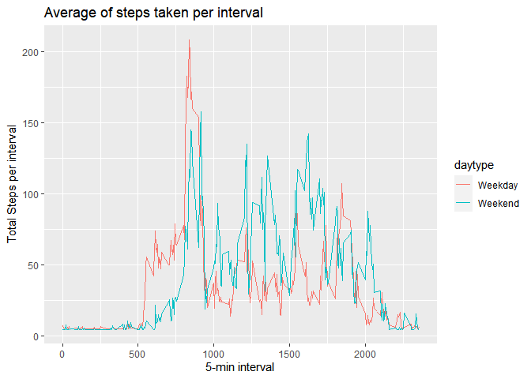

# Intro
It is now possible to collect a large amount of data about personal movement using activity monitoring devices such as a Fitbit, Nike Fuelband, or Jawbone Up. These type of devices are part of the "quantified self" movement -- a group of enthusiasts who take measurements about themselves regularly to improve their health, to find patterns in their behavior, or because they are tech geeks. But these data remain under-utilized both because the raw data are hard to obtain and there is a lack of statistical methods and software for processing and interpreting the data.

This assignment makes use of data from a personal activity monitoring device. This device collects data at 5 minute intervals through out the day. The data consists of two months of data from an anonymous individual collected during the months of October and November, 2012 and include the number of steps taken in 5 minute intervals each day.

## Data
Data is predownloaded.

The variables included in this dataset are:

    steps: Number of steps taking in a 5-minute interval (missing values are coded as NA)

    date: The date on which the measurement was taken in YYYY-MM-DD format

    interval: Identifier for the 5-minute interval in which measurement was taken

The dataset is stored in a comma-separated-value (CSV) file and there are a total of 17,568 observations in this dataset.

Lets extract data:


```r
unzip("activity.zip")
```

## Quick look


```r
library(scales)
data <- read.csv(file = 'activity.csv')
data$date<-as.Date(data$date,format="%Y-%m-%d")
head(data)
```

```
##   steps       date interval
## 1    NA 2012-10-01        0
## 2    NA 2012-10-01        5
## 3    NA 2012-10-01       10
## 4    NA 2012-10-01       15
## 5    NA 2012-10-01       20
## 6    NA 2012-10-01       25
```

```r
summary(data)
```

```
##      steps             date               interval     
##  Min.   :  0.00   Min.   :2012-10-01   Min.   :   0.0  
##  1st Qu.:  0.00   1st Qu.:2012-10-16   1st Qu.: 588.8  
##  Median :  0.00   Median :2012-10-31   Median :1177.5  
##  Mean   : 37.38   Mean   :2012-10-31   Mean   :1177.5  
##  3rd Qu.: 12.00   3rd Qu.:2012-11-15   3rd Qu.:1766.2  
##  Max.   :806.00   Max.   :2012-11-30   Max.   :2355.0  
##  NA's   :2304
```

```r
str(data)
```

```
## 'data.frame':	17568 obs. of  3 variables:
##  $ steps   : int  NA NA NA NA NA NA NA NA NA NA ...
##  $ date    : Date, format: "2012-10-01" "2012-10-01" ...
##  $ interval: int  0 5 10 15 20 25 30 35 40 45 ...
```
## Aggregate by day

Aggregate and plot.

<!-- -->

Data show that most probable count of steps is 10k to 15k per day (~27% probability).

Mean:

```r
mean(byday$steps)
```

```
## [1] 10766.19
```
Median:

```r
median(byday$steps)
```

```
## [1] 10765
```
## Average daily activity


```r
time_series <- tapply(data$steps, data$interval, mean, na.rm = TRUE)
plot(row.names(time_series), time_series, type = "l", xlab = "5-min interval", 
    ylab = "Total Steps per interval", main = "Average  of steps taken", 
    col = "green")
```

<!-- -->

```r
maxsteps<-data[which.max(data$steps),]
```

Maximum steps 806 was taken on 2012-11-27 in 5 minutes interval.

## Imputing missing values

Check for missing values

```r
miss<-mean(is.na(data$steps))
```
Looks like we have about 13% missing data for steps.

Will load library for imputing mean.


```r
library(Hmisc)
```

```
## Warning: package 'Hmisc' was built under R version 4.0.2
```

```
## Loading required package: lattice
```

```
## Loading required package: survival
```

```
## Loading required package: Formula
```

```
## Loading required package: ggplot2
```

```
## 
## Attaching package: 'Hmisc'
```

```
## The following objects are masked from 'package:base':
## 
##     format.pval, units
```

```r
new_data<-data
summary(new_data)
```

```
##      steps             date               interval     
##  Min.   :  0.00   Min.   :2012-10-01   Min.   :   0.0  
##  1st Qu.:  0.00   1st Qu.:2012-10-16   1st Qu.: 588.8  
##  Median :  0.00   Median :2012-10-31   Median :1177.5  
##  Mean   : 37.38   Mean   :2012-10-31   Mean   :1177.5  
##  3rd Qu.: 12.00   3rd Qu.:2012-11-15   3rd Qu.:1766.2  
##  Max.   :806.00   Max.   :2012-11-30   Max.   :2355.0  
##  NA's   :2304
```

```r
new_data$steps<- with(new_data, impute(new_data$steps, mean))
summary(new_data)
```

```
## 
##  2304 values imputed to 37.3826
```

```
##      steps             date               interval     
##  Min.   :  0.00   Min.   :2012-10-01   Min.   :   0.0  
##  1st Qu.:  0.00   1st Qu.:2012-10-16   1st Qu.: 588.8  
##  Median :  0.00   Median :2012-10-31   Median :1177.5  
##  Mean   : 37.38   Mean   :2012-10-31   Mean   :1177.5  
##  3rd Qu.: 37.38   3rd Qu.:2012-11-15   3rd Qu.:1766.2  
##  Max.   :806.00   Max.   :2012-11-30   Max.   :2355.0
```


```r
miss_new<-mean(is.na(new_data$steps))
```
No more missing data

Lets plot it:

```r
new_byday<-aggregate(steps ~ date , new_data, sum, na.rm = TRUE)
hist(byday$steps, col="green", main="Steps count per day distribution", xlab="Steps")
```

<!-- -->

Mean:

```r
mean(new_byday$steps)
```

```
## [1] 10766.19
```

```r
mean(new_byday$steps)==mean(new_byday$steps)
```

```
## [1] TRUE
```
Median:

```
## [1] 10766.19
```

```
## [1] TRUE
```

Mean and median did not changed with imputed mean values.

## Are there differences in activity patterns between weekdays and weekends?

We need to separate weekend from weekdays:


```r
wd <- function(d) {
    weekday <- weekdays(as.Date(d, '%Y-%m-%d'))
    if  (!(weekday == 'Saturday' || weekday == 'Sunday')) {
        d <- 'Weekday'
    } else {
        d <- 'Weekend'
    }
    d
}
```

Create new column in data:


```r
new_data$daytype <- as.factor(sapply(new_data$date, wd))
```

Aggregate and plot:


```r
byint_bywd <- aggregate(steps ~ interval+daytype,new_data , mean)

plt <- ggplot(byint_bywd, aes(interval, steps)) +
    geom_line(stat = "identity", aes(colour = daytype)) +
    theme_gray() +
    labs(x="5-min interval", y=expression("Total Steps per interval")) +
    ggtitle("Average of steps taken per interval")
print(plt)
```

<!-- -->

On weekend activity starts later (need to get that sweet morning sleep) and it is less intensive than on weekdays. Middle of the day on weekends is more active. 
